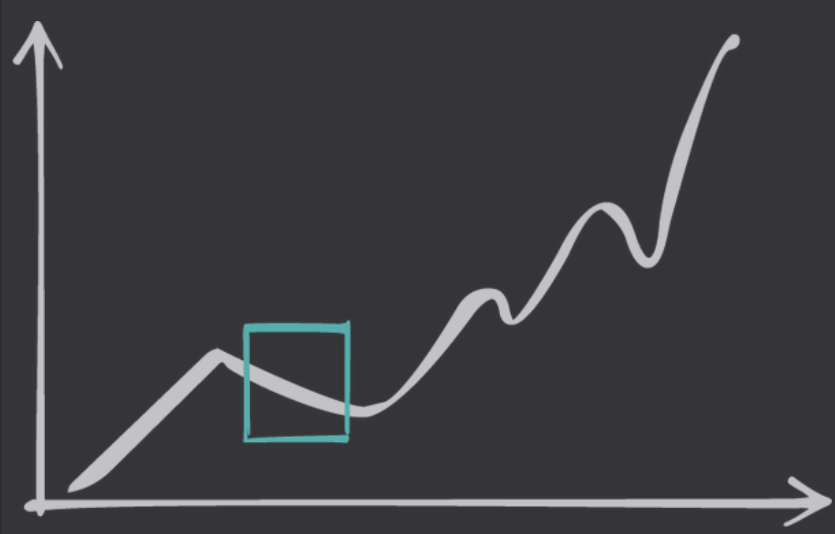

## Notes from Section 1: “DRIing Your Career” and Section 2: “Self-Management”
- The goal isn't to optimize for this moment-the current job- but for your overall career
- The Work > The Title , a job title is a few words. The work is 40 or more hours a week
- This job is just a `moment` in your career
- Regularly thinking critically about what you're getting from your environment-and what you're not is key to sustained and sustainable growth
- Capable ICs are often differentiated by strong time management, thats what makes them more effective than people with comparable technical skills
- Deep relationships and engaging hobbies help people disconnect because they are *connecting*  to something else entirely rather than just trying to separate themselves from work
- Managing Energy Versus Managing Time: Assess your energy managemnt and make your plan

Defining the Moment:

The bigger picture is the most important thing; even if you see a small dip in trajectory, the overall trend is moving up.

Deciding what this moment is helps you decide what to do with it:

…a moment of opportunity:
What potential does this create? What optionality does it facilitate?

…a moment of challenge:
This is the power of the stretch assignment—meet the challenge, see what opens up as a result.

…a moment of trauma:
The most dangerous moment—is this moment creating something you will carry with you and need to untangle later? Tread carefully.

…a moment of calm:
Sometimes we need our jobs to just be fine—not too stressful, not too challenging—to create space for other things in our lives.

https://bookshop.org/p/books/the-engineering-leader-strategies-for-scaling-teams-and-yourself-cate-huston/20701054?ean=9781098154066