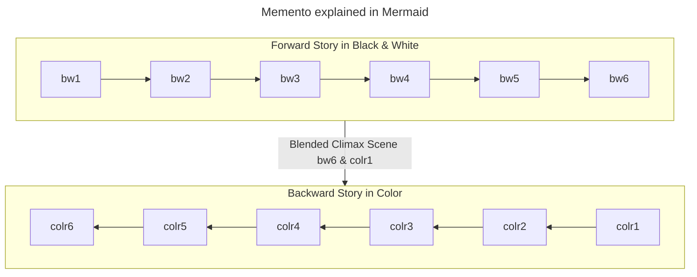

```mermaid
---
title: Memento explained in Mermaid
---

flowchart TD

subgraph Z["Forward Story in Black & White "]
direction LR
  bw1 --> bw2
  bw2 --> bw3
  bw3 --> bw4
  bw4 --> bw5
  bw5 --> bw6
end

subgraph ZA["Backward Story in Color"]
direction RL
    colr1-->colr2
    colr2-->colr3
    colr3-->colr4
    colr4-->colr5
    colr5-->colr6
end

Z -- Blended Climax Scene bw6 & colr1 --> ZA
```